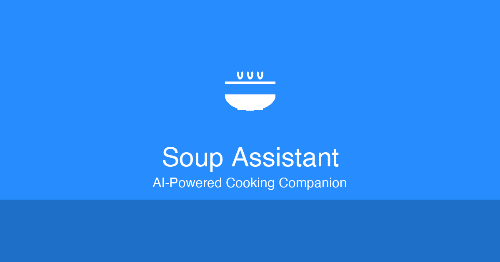

# Soup Assistant

AI-powered soup cooking assistant with 8 delicious recipes. Get step-by-step guidance, ingredient substitutions, and real-time cooking tips.



## Features

- **AI Chat Interface** - GPT-5.1 powered conversational assistant with streaming responses
- **8 Curated Recipes** - Lasagna Soup, Tortellini Soup, Cheeseburger Soup, Potato Sausage Soup, Baked Ziti Soup, Boursin Soup, Chicken Gnocchi Soup, and Chicken Alfredo Soup
- **Step-by-Step Guidance** - Detailed cooking instructions with timing cues
- **Ingredient Help** - Substitution suggestions and shopping tips
- **PWA Support** - Install on iOS/Android home screen for app-like experience
- **Dark/Light Theme** - Toggle between themes with persistent preference
- **Mobile Optimized** - Responsive design with floating input bar and keyboard handling
- **Session Persistence** - Chat history saved during your session

## Security Features

- Rate limiting (30 requests/minute)
- Input validation and sanitization
- Content Security Policy (CSP) headers
- CORS protection (same-origin only)
- XSS and clickjacking protection
- Production error handling (no sensitive info exposed)

## Quick Start

### Prerequisites

- PHP 7.4+ with cURL extension
- Web server (Apache/Nginx) or XAMPP/MAMP
- OpenAI API key

### Installation

1. **Clone the repository**
   ```bash
   git clone https://github.com/kmkinsall/soup.git
   cd soup
   ```

2. **Configure your API key**
   ```bash
   cp .env.example .env
   ```
   Edit `.env` and add your OpenAI API key:
   ```
   OPENAI_API_KEY=your-api-key-here
   ```

3. **Set file permissions** (if needed)
   ```bash
   chmod 644 *.php *.js *.css *.html *.json *.svg *.png
   ```

4. **Access the app**
   - Open `http://localhost/soup/` in your browser
   - Or configure your web server to serve the directory

## Project Structure

```
soup/
├── index.html          # Main HTML file
├── app.js              # Frontend JavaScript (chat, UI, PWA)
├── styles.css          # All styles (light/dark themes)
├── api.php             # API endpoint (handles OpenAI requests)
├── config.php          # Configuration and system prompt
├── security.php        # Security module (rate limiting, validation)
├── sw.js               # Service worker for PWA
├── manifest.json       # PWA manifest
├── .env                # Environment variables (not in repo)
├── .env.example        # Environment template
└── [icons]             # Various PNG/SVG icons
```

## Configuration

### Environment Variables

| Variable | Description | Required |
|----------|-------------|----------|
| `OPENAI_API_KEY` | Your OpenAI API key | Yes |

### Model Settings (in config.php)

| Setting | Default | Description |
|---------|---------|-------------|
| `OPENAI_MODEL` | gpt-5.1 | OpenAI model to use |
| `TEMPERATURE` | 0.7 | Response creativity (0-1) |
| `TOP_P` | 0.9 | Nucleus sampling |
| `ENABLE_STREAMING` | true | Stream responses in real-time |

### Security Settings (in api.php)

| Setting | Default | Description |
|---------|---------|-------------|
| `$isProduction` | true | Set to `false` for debug errors |
| Rate Limit | 30/min | Requests per minute per session |
| Max Message | 2000 chars | Maximum message length |

## API Reference

### POST /api.php

Send a message to the AI assistant.

**Request:**
```json
{
  "message": "How do I make lasagna soup?",
  "history": [],
  "stream": true,
  "activeRecipe": "Lasagna Soup"
}
```

**Response (streaming):**
```
data: {"content":"Here's"}
data: {"content":" how"}
data: {"content":" to"}
data: {"content":" make"}
...
data: [DONE]
```

**Error Response:**
```json
{
  "error": "Error message here"
}
```

## PWA Installation

### iOS (Safari)
1. Open the app in Safari
2. Tap the Share button
3. Select "Add to Home Screen"

### Android (Chrome)
1. Open the app in Chrome
2. Tap the menu (⋮)
3. Select "Add to Home Screen"

## Development

### Running Locally

1. Start XAMPP/MAMP or your local PHP server
2. Set `$isProduction = false` in `api.php` for debug output
3. Access via `http://localhost/path/to/soup/`

### Adding New Recipes

Edit `config.php` and add to the `SOUP_KNOWLEDGE_BASE` constant following the existing format.

## Tech Stack

- **Frontend:** Vanilla JavaScript, CSS3
- **Backend:** PHP 7.4+
- **AI:** OpenAI GPT-5.1 (Responses API)
- **Icons:** Lucide Icons (inline SVG)
- **Fonts:** Inter (Google Fonts)

## License

MIT License - feel free to use and modify.

## Credits

- Recipes inspired by "8 Soups to keep you alive until April" by Eric Segev
- Original recipes from [Frida Sofia Eats](https://www.fridasofiaeats.com)

---

Built with Claude Code
